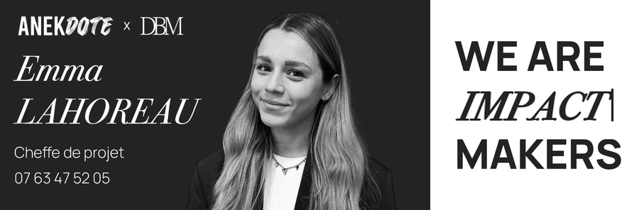

# Signature Emma LAHOREAU

Signature HTML de **450 × 148 px**, conforme aux proportions de la maquette.
Seul le téléphone est cliquable : `tel:+33763475205`.
Les logos ANEKDOTE × DBM et le bloc animé n'ont aucun lien.



## Utilisation

1. Télécharger `signature.html` puis l'ouvrir dans un navigateur. Ses images sont
   hébergées dans ce dépôt avec des adresses HTTPS absolues.
2. Sélectionner la signature affichée, la copier et la coller dans le réglage
   « signature » de la messagerie. Ne pas copier le code depuis l'aperçu GitHub.
3. Envoyer un message de contrôle : vérifier les images et le clic sur le numéro.

`signature-fragment.html` contient seulement le tableau à intégrer, sans page autour.
`apercu-local.html` ouvre la même signature sans connexion lorsque le dossier
`assets` est présent à côté. Il sert à la vérification locale ; utiliser
`signature.html` pour l'installation dans une messagerie.

La mise en page utilise des tableaux, des dimensions explicites et des images PNG/GIF
en double résolution, sans JavaScript, police distante ni image de fond CSS dans
le courriel. Le texte est intégré aux images pour préserver exactement la maquette ;
des textes alternatifs décrivent l'identité et le téléphone. Si une messagerie bloque
les images distantes, elle doit autoriser leur chargement. Un lecteur qui ne joue pas
les GIF affiche leur première image, où le slogan est complet.

## Fichiers modifiables

- `signature.json` : prénom, nom, fonction, téléphone et chemins des ressources.
- `emma signa.png` : photographie originale, déplacée depuis la racine du dépôt.
- `source/portrait.png` : portrait sur fond anthracite extrait de la maquette validée.
- `source/maquette.png` : référence d'origine pour conserver les pixels et les logos.
- `assets/` : images utilisées par le courriel, générées automatiquement.
- `../scripts/build_signature.py` : générateur partagé par toute l'équipe.

## Créer une autre signature

1. Dupliquer `EMMA L` et renommer le dossier.
2. Modifier `first_name`, `last_name`, `role`, `phone_display`, `phone_href` dans
   `signature.json`. Le numéro du lien doit être au format international, sans espaces.
3. Ajouter la nouvelle photo et un portrait détouré PNG ; renseigner `photo` pour
   archiver la photo d'origine et **`photo_cutout` pour le portrait utilisé au rendu**.
   Donner au nouveau portrait un autre nom que `source/portrait.png`. Un fond
   transparent ou anthracite `#232323` convient. Il est ajusté proportionnellement
   dans la zone photo et aligné en bas.
4. Remplacer `EMMA%20L` dans `asset_base_url` par le nom du nouveau dossier,
   en encodant les espaces avec `%20`.
5. À la racine du dépôt :

   ```sh
   python3 -m pip install -r requirements.txt
   python3 scripts/build_signature.py "NOUVEAU DOSSIER"
   ```

6. Contrôler `apercu-local.html`, puis déposer l'ensemble du nouveau dossier sur GitHub.

Les champs inchangés d'Emma réutilisent les pixels d'origine. Les champs modifiés
sont recomposés et réduits automatiquement s'ils sont trop longs. Pour ces champs,
`name_font` et `detail_font` acceptent des chemins vers des polices TTF/OTF ; sans
chemin, le script cherche Times New Roman Italic et Helvetica Neue sur macOS,
puis Liberation Serif/Sans sous Linux. Fournir les polices de marque pour une
typographie strictement identique sur les futures déclinaisons.

## Animation

Le fichier original est déjà sur trois lignes. La version adaptée conserve ses
69 images, leurs durées (13,7 secondes par boucle), le curseur et les changements
du mot central. Les lignes fixes WE ARE et MAKERS reprennent celles de la maquette.
Le mot animé est recadré et mis à l'échelle dans la ligne centrale. Le GIF original
n'est pas écrasé.

## Vérification

L'aperçu composé a été inspecté visuellement ; les dimensions, les fichiers images,
le lien unique et les 69 durées du GIF ont été vérifiés. La déclinaison d'un autre
profil a également été testée. L'ouverture locale dans le navigateur de contrôle
n'a pas été autorisée par sa politique de sécurité.
La structure du courriel reste à valider par un envoi dans la messagerie utilisée :
aucun test d'envoi réel Outlook/Gmail/Apple Mail n'est inclus dans cette livraison.
